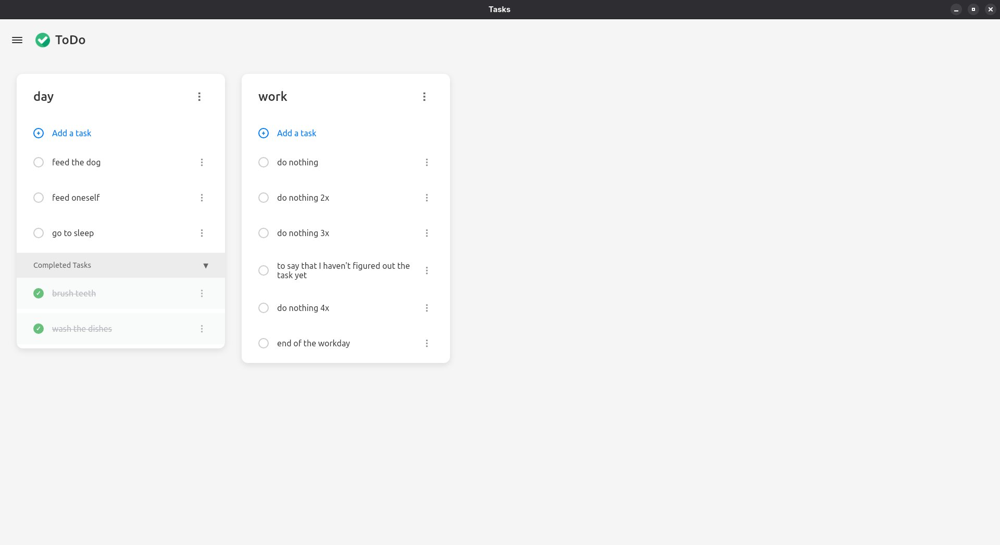
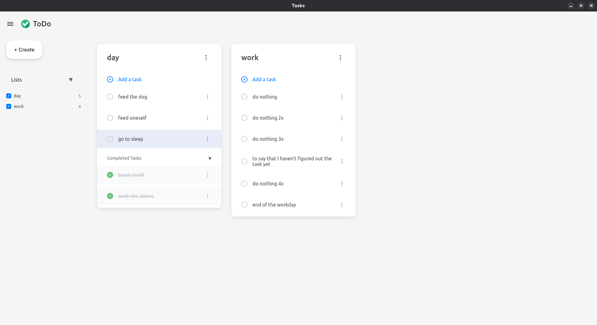
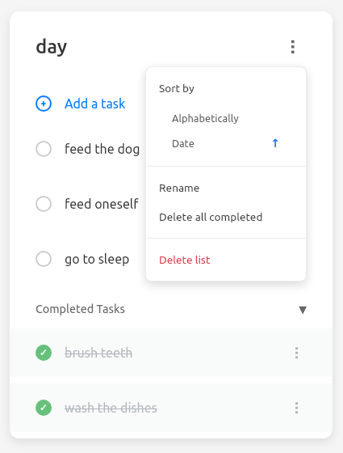

# ToDo Application

A modern, responsive to-do application built with Wails (Go + React) and PostgreSQL, featuring a robust configuration system and comprehensive task management.

## Features

### Frontend
- **Modern UI**: Clean, responsive design with smooth animations
- **Sidebar Navigation**: Collapsible sidebar with menu toggle
- **Horizontal Scroll**: Lists are displayed in a horizontal scrollable container
- **Task Management**: 
  - Create, read, update, and delete tasks
  - Toggle task completion with checkboxes
  - Strikethrough styling for completed tasks
  - Separate completed tasks section (collapsible)
  - Delete tasks with confirmation
- **List Management**:
  - Create new lists
  - View all lists in sidebar
  - Drag and drop to reorder lists
  - Add tasks to specific lists

### Backend
- **PostgreSQL Database**: Robust data storage with proper relationships
- **UUID-based IDs**: Secure UUID identifiers for all entities
- **CRUD Operations**: Complete Create, Read, Update, Delete functionality
- **Cascading Deletes**: Deleting a list removes all its tasks and subtasks
- **Automatic Timestamps**: Created and updated timestamps for all records
- **Configuration System**: Environment-based configuration with .env support
- **Structured Logging**: JSON-based logging with configurable levels

## Database Schema

### Lists
- `id` (UUID PRIMARY KEY)
- `title` (VARCHAR)
- `position` (INTEGER) - For drag and drop ordering
- `created_at` (TIMESTAMP)
- `updated_at` (TIMESTAMP)

### Tasks
- `id` (UUID PRIMARY KEY)
- `list_id` (UUID FOREIGN KEY)
- `task_name` (VARCHAR)
- `completed` (BOOLEAN)
- `created_at` (TIMESTAMP)
- `updated_at` (TIMESTAMP)

### SubTasks
- `id` (UUID PRIMARY KEY)
- `task_id` (UUID FOREIGN KEY)
- `subtask_name` (VARCHAR)
- `completed` (BOOLEAN)
- `created_at` (TIMESTAMP)
- `updated_at` (TIMESTAMP)

## Getting Started

### Prerequisites
- Go 1.25.1 or later
- Node.js and npm
- PostgreSQL database
- Wails v2

### Installation

1. **Clone the repository**
   ```bash
   git clone <repository-url>
   cd to-do
   ```

2. **Configure the application**
   ```bash
   # Copy the example environment file
   cp .env.example .env
   
   # Edit the configuration
   nano .env
   ```

3. **Set up the database**
   - Create a PostgreSQL database
   - Update the database configuration in `.env` file
   - Default configuration:
     ```
     DB_HOST=localhost
     DB_PORT=5432
     DB_USER=postgres
     DB_PASSWORD=password
     DB_NAME=todo_db
     DB_SSLMODE=disable
     LOG_LEVEL=info
     ```

4. **Install dependencies**
   ```bash
   # Backend dependencies
   go mod tidy
   
   # Frontend dependencies
   cd frontend
   npm install
   cd ..
   ```

5. **Build and run**
   ```bash
   # Development mode
   wails dev
   
   # Build for production
   wails build
   ```

## Usage

### Creating Lists
1. Click the menu button (☰) to open the sidebar
2. Click "+ Create New List" button
3. Enter a list name and click "Create"

### Adding Tasks
1. In any list, click "+ Add a task"
2. Enter task name
3. Click "Add" to create the task

### Managing Tasks
- **Complete a task**: Click the checkbox next to the task
- **Delete a task**: Click the "×" button next to the task
- **View completed tasks**: Click on "Completed (X)" to expand/collapse
- **Add subtasks**: Click on a task to add subtasks

### Navigation
- **Sidebar**: Contains list of all lists and create new list button
- **Main area**: Horizontal scrollable list of all your lists
- **Responsive**: Works on desktop and mobile devices

## API Functions

The application exposes the following functions to the frontend:

### Lists
- `CreateList(title string) (*List, error)`
- `GetList(id string) (*List, error)`
- `GetAllLists() ([]List, error)`
- `UpdateList(id string, title string) (*List, error)`
- `DeleteList(id string) error`
- `ReorderLists(listIDs []string) error`

### Tasks
- `CreateTask(listID string, taskName string) (*Task, error)`
- `GetTask(id string) (*Task, error)`
- `GetTasksByListID(listID string) ([]Task, error)`
- `GetAllTasks() ([]Task, error)`
- `UpdateTask(id string, taskName string, completed bool) (*Task, error)`
- `ToggleTaskCompletion(id string) (*Task, error)`
- `DeleteTask(id string) error`

### SubTasks
- `CreateSubTask(taskID string, subTaskName string) (*SubTask, error)`
- `GetSubTask(id string) (*SubTask, error)`
- `GetSubTasksByTaskID(taskID string) ([]SubTask, error)`
- `GetAllSubTasks() ([]SubTask, error)`
- `UpdateSubTask(id string, subTaskName string, completed bool) (*SubTask, error)`
- `ToggleSubTaskCompletion(id string) (*SubTask, error)`
- `DeleteSubTask(id string) error`

## Architecture

### Backend Structure
```
internal/
├── models.go          # Data models (List, Task, SubTask)
├── config/
│   └── config.go      # Configuration management
└── db/
    ├── db.go          # Database connection and initialization
    ├── lists.go       # List CRUD operations
    ├── tasks.go       # Task CRUD operations
    └── subtasks.go    # SubTask CRUD operations
```

### Frontend Structure
```
frontend/src/
├── App.jsx            # Main application component
├── App.css            # Application styles
├── main.jsx           # Application entry point
├── components/        # React components
│   ├── Header.jsx
│   ├── Sidebar.jsx
│   ├── TaskList.jsx
│   ├── TaskItem.jsx
│   └── SubTaskItem.jsx
└── hooks/             # Custom React hooks
    ├── useTodoData.js
    └── useTaskActions.js
```

## Configuration

The application features a robust configuration system that supports environment variables and `.env` files. See [CONFIG.md](CONFIG.md) for detailed configuration options.

### Quick Configuration

1. **Copy the example environment file:**
   ```bash
   cp .env.example .env
   ```

2. **Edit the configuration:**
   ```bash
   nano .env
   ```

3. **Environment Variables:**
   - `DB_HOST` - Database host (default: localhost)
   - `DB_PORT` - Database port (default: 5432)
   - `DB_USER` - Database username (default: postgres)
   - `DB_PASSWORD` - Database password (default: password)
   - `DB_NAME` - Database name (default: todo_db)
   - `DB_SSLMODE` - SSL mode (default: disable)
   - `LOG_LEVEL` - Logging level (default: info)

### Configuration Features

- **Environment Variable Support**: Override any setting with environment variables
- **Default Values**: Sensible defaults for all configuration options
- **Validation**: Automatic validation of configuration values
- **Structured Logging**: JSON-based logging with configurable levels

## Technologies Used

- **Backend**: Go, PostgreSQL, pgx/v5
- **Frontend**: React, Vite, CSS3
- **Framework**: Wails v2
- **Database**: PostgreSQL with UUID primary keys
- **Configuration**: Environment variables with .env support

## Screenshots

### Main Interface

*Main application interface showing task lists with horizontal scroll*

### Sidebar Navigation

*Collapsible sidebar with lists management and create button*

### Task Management

*Creating and managing tasks with subtasks functionality*

### Completed Tasks

*Completed tasks section with collapsible view and strikethrough text*

### Settings Menu

*Sorting options and list management settings*

### Drag and Drop

*Drag and drop functionality for reordering lists*